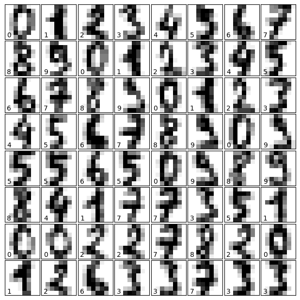
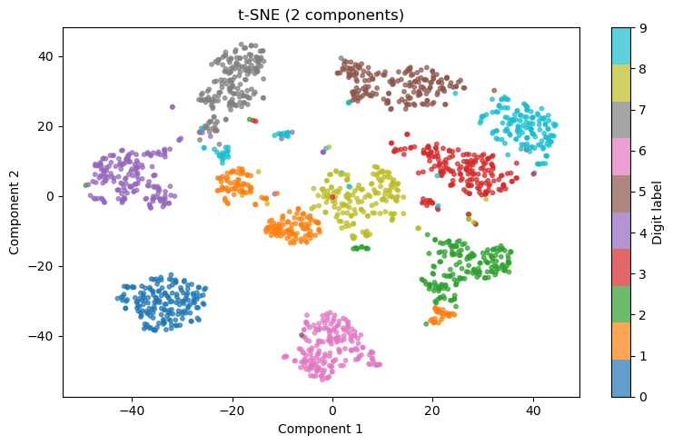
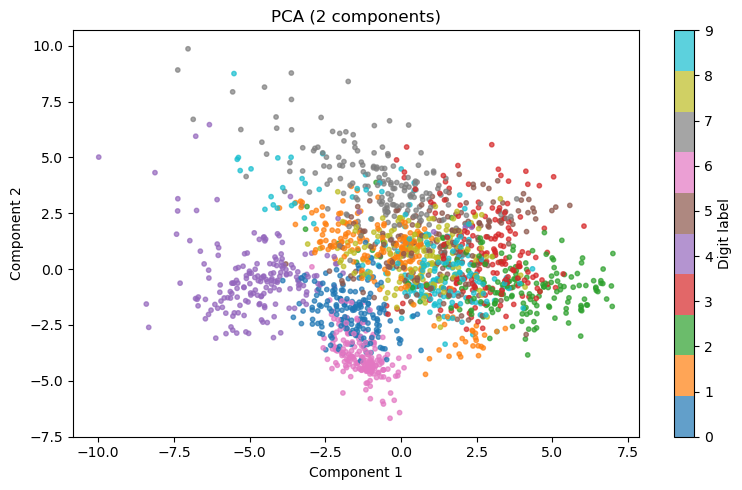
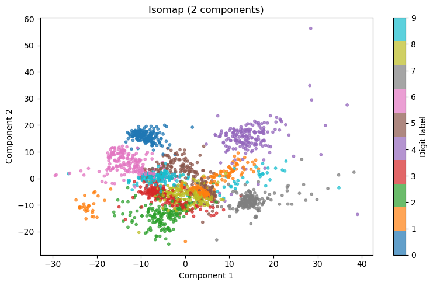
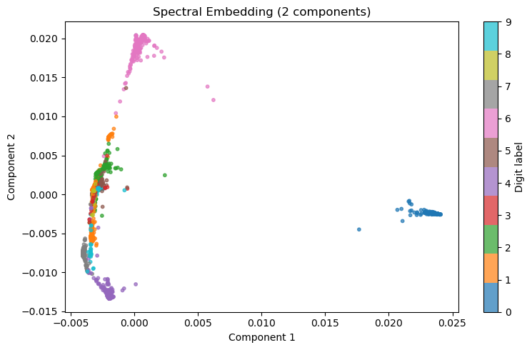

# Neural Network Pattern Recognition: Handwritten Digit Classification

## Project Overview
This project implements a supervised learning system designed to classify handwritten digits (0-9) from the Scikit-learn digits dataset. By mimicking basic neural architectures, the system learns to interpret low-resolution (8x8 pixel) grids—simulating the type of pattern recognition required for noisy sensor data in aerospace systems.

## 1. Visualizing the Input: "Blurry" Digit Data
The dataset consists of 1,797 samples of 8x8 grayscale images. At this resolution, digits are often ambiguous. This project demonstrates how a Multi-Layer Perceptron (MLP) can achieve high-fidelity classification despite low-fidelity input.

*Above: A sample of the 8x8 pixel training data showing the "noisy" nature of the input.*

## Technical Implementation
### 1. Supervised Learning (MLP)
* **Model**: Multi-Layer Perceptron (ANN).
* **Optimization**: Stochastic Gradient Descent (SGD) with Sigmoid activation.

### The Optimization Loop
To find the most efficient architecture, I ran an optimization loop testing **30 different hidden layer configurations** (ranging from 5 to 34 neurons). 

| Metric | Baseline Model | Optimized Model | Improvement |
| :--- | :--- | :--- | :--- |
| **Hidden Neurons** | 5 | 34 | +580% Complexity |
| **Accuracy** | ~78.4% | **92.6%** | **+14.2% Gain** |

### 2. Dimensionality Reduction & Visualization
To understand the mathematical "separability" of the data, I compared four different techniques:
* **PCA (Linear)**: Capturing maximum variance.
* **t-SNE (Probabilistic)**: High-fidelity clustering of similar digits.
* **Isomap (Manifold)**: Preserving the "geodesic" distance along curved data structures.
* **Spectral Embedding (Graph Theory)**: Mapping data based on connectivity.

## 3. Dimensionality Reduction (Manifold Learning)
To understand why the Neural Network was successful, I utilized four unsupervised learning methods to project the 64-dimensional pixel data onto a 2D plane. This proves the mathematical "separability" of the digit clusters.

| Method | Visualization | Logic |
| :--- | :--- | :--- |
| **t-SNE** |  | **Highest Fidelity:** Created distinct "neighborhoods" for each digit. |
| **PCA** |  | **Linear Variance:** Shows the primary axes of data spread. |
| **Isomap** |  | **Manifold Learning:** Preserves the curved structure of the data. |
| **Spectral** |  | **Graph Theory:** Maps connectivity between similar pixel patterns. |
## Key Findings
* **Complexity vs. Accuracy**: Increasing the hidden layer size from 5 to 34 neurons showed a clear trend in stabilizing model performance.
* **Clustering**: t-SNE provided the most distinct separation, suggesting that digit recognition is highly dependent on local neighborhood relationships in the pixel space.

## Environment & Libraries
* **Language**: Python 3.x
* **Libraries**: NumPy, Matplotlib, Scikit-learn
* **Editor**: Visual Studio Code (Jupyter Extension)

